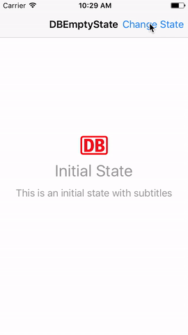

# DBEmptyState

 

DBEmptyState helps you to manage your empty/error/whatever states inside your TableView. 
You can define states and representations which get displayed once your state is active.

## Example

Inside your ViewController, create and store a `EmptyTableViewAdapter` and a `StateMachine`.

```swift
let emptyState = StateMachine<EmptyState>(initialState: .initial)
var emptyDataSet: EmptyTableViewAdapter<EmptyState>!

override func viewDidLoad() {
    super.viewDidLoad()
    emptyDataSet = EmptyTableViewAdapter(tableView: tableView, stateManaging: emptyState, dataSource: self)
}
```

### Empty Content
Provide content for the states you want by implementing at least `EmptyContentDataSource`.
```swift
extension ExampleViewController: EmptyContentDataSource {
    func emptyContent(for state: EmptyState) -> EmptyContent? {
        switch state {
        case .initial:
            return EmptyContent(title: "Initial State", subtitle: "This is an initial state with subtitles", image: UIImage(named: "image.png"))
        case .loading:
            return .customPresentation // needed when you want to display only a custom view
        case .error:
            return EmptyContent(title: "Error")
        default:
            return nil
        }
    } 
}
```

### Empty Custom View

By implementing `CustomEmptyViewDataSource` and returning a new view for a given state you can override the default layout with a custom view.

```swift
extension ExampleViewController: CustomEmptyViewDataSource {
    func customView(for state: EmptyState, with content: EmptyContent) -> UIView? {
        switch state {
        case .loading:
            let spinner = UIActivityIndicatorView(activityIndicatorStyle: .gray)
            spinner.startAnimating()
            
            return spinner
        default:
            return nil
        }
    }
}
```

### Action Buttons
If you want to add a button into you empty this is possible by implementing `ActionButtonDataSource`

```swift
extension ExampleViewController: ActionButtonDataSource {
    func button(for state: EmptyState) -> ButtonModel? {
        switch state {
        case .error:
            return ButtonModel(title: "Retry", action: {})
        default:
            return nil
        }
    }
}
```

## Requirements

- iOS 9.0+
- Xcode 8.0+
- Swift 3.0

## Installation

### Carthage

[Carthage](https://github.com/Carthage/Carthage) is a decentralized dependency manager that builds your dependencies and provides you with binary frameworks.

Specify the following in your `Cartfile`:

```ogdl
github "dbsystel/DBEmptyState" ~> 0.1
```
## Contributing
Feel free to submit a pull request with new features, improvements on tests or documentation and bug fixes. Keep in mind that we welcome code that is well tested and documented.

## Contact
Lukas Schmidt ([Mail](mailto:lukas.la.schmidt@deutschebahn.com), [@lightsprint09](https://twitter.com/lightsprint09))

## License
DBEmptyState is released under the MIT license. See LICENSE for details.
